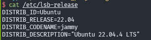
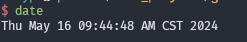
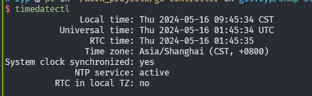

# 时区配置

- 以下配置均在 `Ubuntu 22.04` 测试, 部分命令不保证其他发行版可用
- 

## 查看当前时区

- `date`
  - 
- `timedatectl`
  - 

## 修改时区

- `sudo dpkg-reconfigure tzdata`
  - 交互式修改
- `echo "Asia/Shanghai" > /etc/timezone`

## 更新系统时间

- `sudo systemctl restart systemd-timesyncd`
- `sudo service systemd-timesyncd restart`